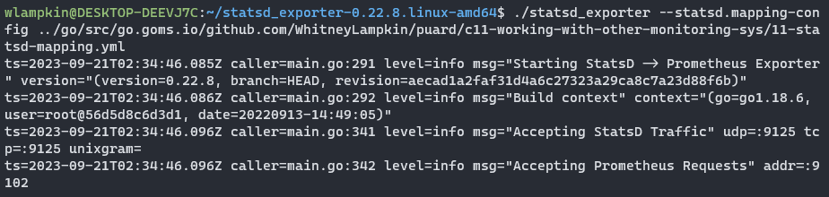

# C10. Common Exporters

> TODO: Add all chapter notes

## Other Monitoring Systems

## InfluxBD
- Similar to Prometheus, little effort to integrate

### Demo

- Running InfluxDB Exporter locally

- Sending metrics manually

- InfluxDB Metrics

## StatsD
- Uses events instead of metrics

### Demo

- Running StatsD locally

- StatsD Metrics

- Manually defining Gauges

- Manually defining Summary/Historm metrics

- Manually defining Counters

- StatsD Example w/ Mapping Config

## List of Monitoring Systems and Exporters
- Collectd
- InfluxBD
- Graphite
- StatsD
- Java Management eXtensions (JMX)
- SNMP
- CloudWatch Exporter
- New Relic Exporter
- Pingdom Exporter
- Stackdriver Exporter
- NRPE Exporter