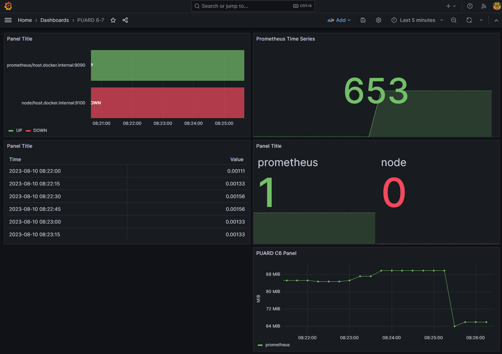
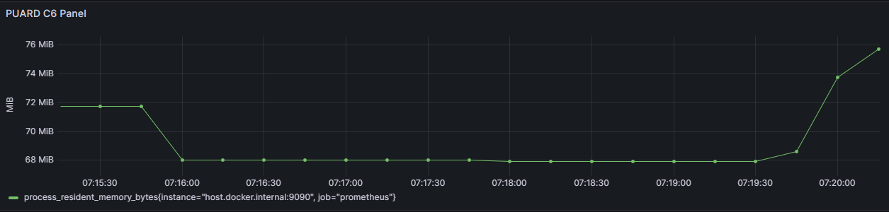
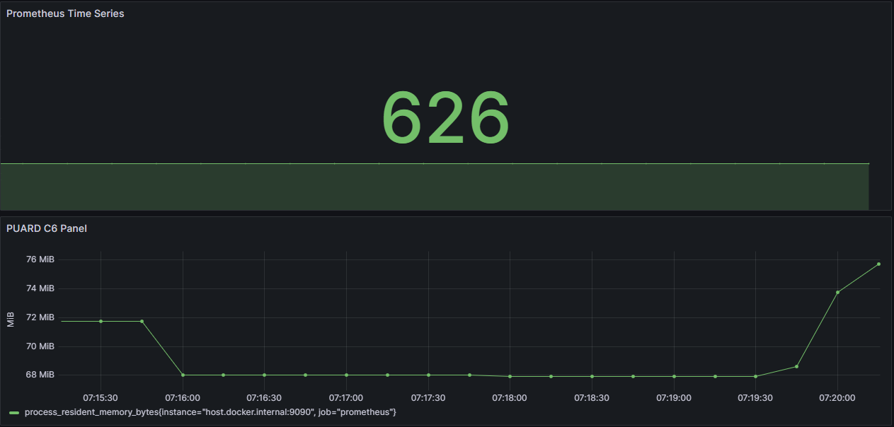
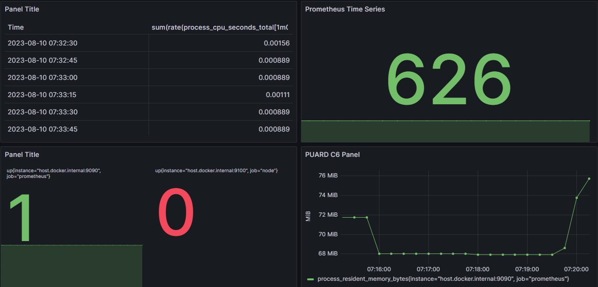
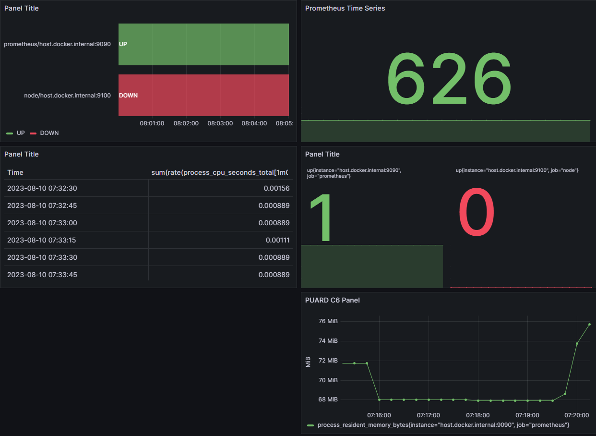
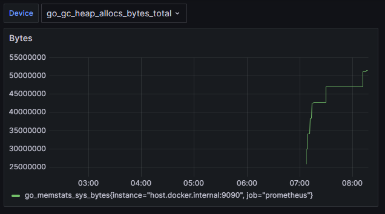

# C6. Dashboarding with Grafana

IMPORTANT: Must use host.docker.internal:9090 for Prometheus in Grafana when running with Docker Compose

## Final Grafana Dashboard

## Notes

### Panels

- Time Series Panel
- Stat Panel
- Table Panel
- State Timeline Panel

#### Panel Demos

- Time Series Panel: _6-7 Memory Usage graph with custom legend, title, and axis units configured_

- Stat Panel: _6-10 Dashboard with a graph (bottom) and Stat panel (top)_

- Table Panel

- State Timeline Panel

### Template Variables

