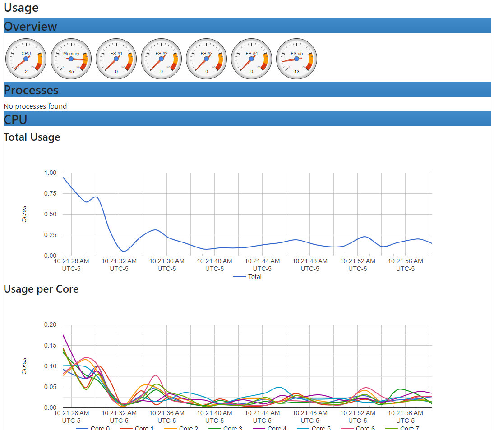
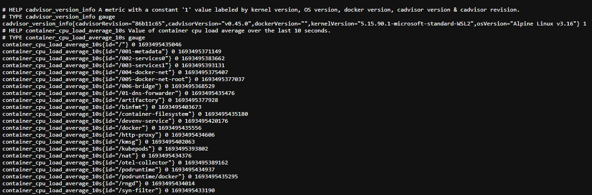

# C9. Containers and Kubernetes

>TODO: Add info about running chapter examples

## cAdvisor

- cAdvisor: exporter provides metrics about cgroups
    - CPU Metrics
    - Memory Metrics
- cgroups: Linux kernel isolation feature used for container implementation on Linux
- Run cAdvisor w/ Docker
  ```shell
  docker run \
  --volume=/:/rootfs:ro \
  --volume=/var/run:/var/run:rw \
  --volume=/sys:/sys:ro \
  --volume=/var/lib/docker/:/var/lib/docker:ro \
  --volume=/dev/disk/:/dev/disk:ro \
  --publish=8080:8080 \
  --detach=true \
  --name=cadvisor \
  gcr.io/cadvisor/cadvisor:v0.45.0
  ```
- cAdvisor running locally on localhost:8080/containers
    
- cAdvisor metrics
    
